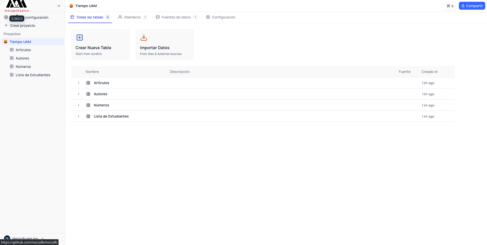
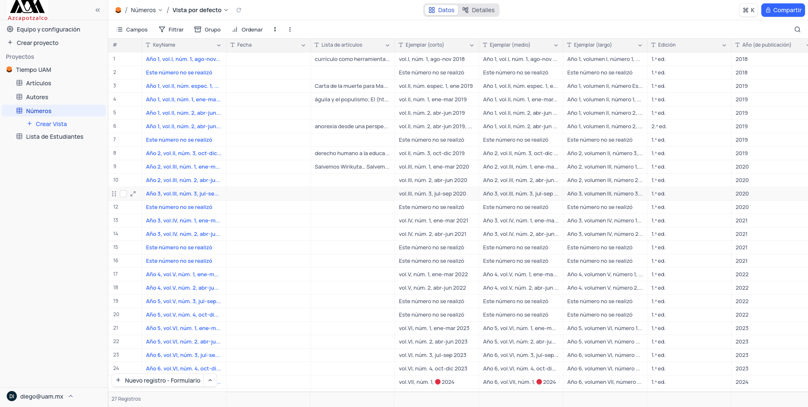

# 📄 Proyecto Paperly

Paperly es una plataforma de gestión de bases de datos para la revista TiempoUAM

### Pantalla Principal

### Tablas


## Docker 

Para desplegar este repositorio recomendamos utilizar la última imagen de Docker construida.

### 🐳 Usar la imagen Docker de `dracomt/paperly-uam`

Si no deseas configurar todo el entorno de desarrollo, puedes usar la imagen de Docker que ya hemos subido a Docker Hub.

#### 1. Descargar la imagen

Puedes hacer pull de la imagen directamente desde Docker Hub con el siguiente comando:

```sh
docker pull dracomt/paperly-uam:latest
```

#### 2. Ejecutar la imagen en un contenedor

Una vez que la imagen se haya descargado, puedes ejecutar el contenedor con el siguiente comando:

```sh
docker run -d -p 8080:8080 dracomt/paperly-uam:latest
```
#### 3. Acceder a la aplicación

Una vez que el contenedor esté en ejecución, puedes acceder a la aplicación en tu navegador:`http://localhost:8080`

---

# 💻 Desarrollo

## 🚀 Clonar el repositorio

```sh
git clone https://github.com/ricardo-montoya/paperly
# Cambiar al directorio del proyecto raíz
cd paperly
```

## 📦 Instalar dependencias

```sh
# Ejecutar desde la raíz del proyecto
# Este comando instalará las dependencias, incluyendo la compilación del SDK
pnpm bootstrap
```

## 🎨 Iniciar el Frontend

```sh
# Ejecutar desde la raíz del proyecto
pnpm start:frontend
# Se ejecuta en el puerto 3000
```

## ⚙️ Iniciar el Backend

```sh
# Ejecutar desde la raíz del proyecto
pnpm start:backend
# Se ejecuta en el puerto 8080
```

✨ Cualquier cambio realizado en el frontend y backend se reflejará automáticamente en el navegador.